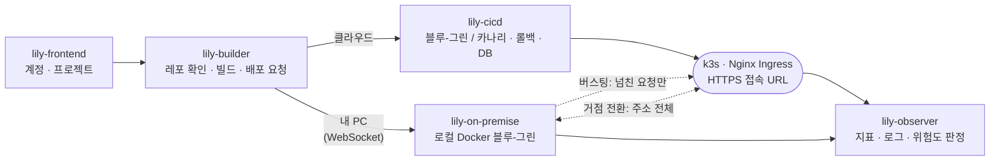

<h1 align="center">🌷 Team Lily</h1>

<p align="center">
  <b>GitHub 레포 URL 하나로 빌드부터 배포, 트래픽 전환, 모니터링까지 자동으로 처리하는 배포 플랫폼</b><br/>
  클라우드와 내 PC를 오가도, 넘치는 요청만 나눠 받아도 <b>공개 주소는 그대로</b><br/>
  SoftBank Hackathon 2026 in Korea 예선 (Term1)
</p>

<p align="center">
  
  
  
  
  
  <br/>
  
  
  
  
  
  
  
  <br/>
  
  
  
  
</p>

---

Vercel처럼 GitHub 주소와 인증 정보만 넣으면, 플랫폼이 레포를 클론해 배포하고 **HTTPS가 적용된 접속 URL**을 돌려줘요. 배포 위치는 k3s 클러스터(클라우드)와 사용자 PC(온프레미스) 중에서 고를 수 있어요.

```
GitHub URL + 인증 정보 입력
→ 레포 클론 · 이미지 빌드 (CI)
→ DB 준비 · 마이그레이션 자동 적용
→ 블루-그린 / 카나리 트래픽 전환 (CD · LB)
→ 카나리 판정 통과 시 전환 완료, 에러율 · 응답 시간 악화 시 자동 롤백
→ HTTPS 접속 URL 반환 (https://{app}.apps.lilycloud.kr)
→ 로그 수집 · 메트릭 대시보드
```

핵심은 **안정적인 무중단 배포**예요. 기본 모듈을 먼저 완성한 뒤 AI 기능을 단계적으로 붙여요.

## 팀 전체 그림

공개 주소는 배포를 반복해도 그대로 둬요. 바뀌는 것은 그 주소가 가리키는 쪽이에요.

| | 하는 일 |
|---|---|
| **카나리 · 롤백** | 새 버전이 Ready가 되어도 바로 100%로 넘기지 않아요. 30초 동안 새 슬롯과 이전 슬롯의 에러율 · p95를 비교하고, 통과하면 Service selector만 새 색으로 바꿔요. 실패하면 새 버전을 지우고 스키마를 되돌리며, 트래픽은 이전 색에 남겨요. 이미 넘긴 뒤에는 이전 슬롯을 다시 띄워 돌려요. |
| **버스팅** | 거점이 사용자 PC일 때, 로컬이 동시에 처리하는 요청이 한도를 넘으면 그 요청만 클라우드로 넘겨요. 공개 주소는 터널에 그대로 있고, 부하가 끝나면 다시 PC가 받아요. 실측: 1,714건 모두 200, 그중 40%를 클라우드가 처리, 부하 종료 20초 뒤 PC로 복귀. |
| **거점 전환** | 같은 주소의 트래픽 전체를 PC와 클라우드 중 한쪽으로 옮겨요. 버스팅(요청 일부)이나 블루-그린(한 거점 안의 버전 교체)과는 달라요. CNAME 내용물만 바꾸고, 목적지가 준비되기 전에는 출발 거점을 유지해요. |
| **모니터링** | 앱 코드를 고치지 않고 입구에서 봐요. 요청 지표와 슬롯 · 버전이 붙은 로그를 모아, 앱마다 지금 괜찮은지를 색과 한 줄로 알려요. |

## 아키텍처



## Infra

| 구성 | 내용 |
|---|---|
| 클러스터 | k3s — server 1대(관리) + worker 2대(앱 실행), AWS EC2 t3.medium |
| 트래픽 | Nginx Ingress — 카나리 · 블루-그린 트래픽 전환 |
| 이미지 | Kaniko 빌드 → Amazon ECR (내 PC는 로컬 Docker 빌드, 레지스트리 없음) |
| 온프레미스 노출 | Cloudflare Tunnel — 인바운드 포트 없이 공개 주소 연결, 인증서는 Cloudflare 엣지 |
| 데이터 | 플랫폼 DB: DynamoDB / 사용자 앱 DB: Amazon RDS (PostgreSQL) |
| 관측 | CloudWatch Agent(지표) · Fluent Bit(로그) → Amazon CloudWatch |

## 핵심 모듈

| 모듈 | 내용 | 담당 |
|---|---|---|
| **CI / CD Module** | 블루-그린 / 카나리 배포 · 카나리 판정 · 롤백 | 이현수, 박준석 |
| **Database Migration Module** | 무중단 스키마 변경 · 판정 실패 시 스키마 되돌리기 | 이현수, 박준석 |
| **On-Premise Module** | 사용자 PC 로컬 블루-그린 · 버스팅 · 거점 전환 | 이현수, 박준석 |
| **Logging Module** | 로그 기록 · 위험도 판정 · 저장 · 롤백 | 심형규, 최도일 |
| **Monitoring System** | 요청 지표 · 슬롯 / 버전 로그 기반 앱 상태 시각화 | 심형규, 최도일 |
| **Load Balancing** | Nginx 기반 트래픽 분산 (다수 컨테이너 운영으로 비용 효율화) | 이도현, 차주혜 |

## 확장 계획 (AI)

기본 모듈이 동작한 뒤 여유가 되는 만큼 추가해요. 첫 단계로 `lily-jev`가 규칙만으로 애매한 선택을 짧게 물어봐요.

- **AI 장애 분석** — 오류 로그를 AI 에이전트에 넘겨 원인 범위를 좁히고, 비개발자도 이해할 수 있게 설명
- **빠른 분류 모델 결합** — 배포 파이프라인의 예/아니오 판단(에러 여부, 롤백 여부 등)을 경량 분류 모델로 빠르게 처리
- **AI 수정 PR** — 분석 결과를 바탕으로 AI 에이전트가 수정본을 GitHub PR로 제안
- **맞춤 대시보드** — 배포된 서비스의 도메인을 분석해 필요한 메트릭 패널을 자동 구성
- **권한 분리** — 서비스별 접근 권한, 운영 서버 배포 승인자 지정
- 서브도메인 제공, manifest 자동화

## Repositories

| 레포 | 설명 |
|---|---|
| [`lily-builder`](https://github.com/SoftBank-team-lily/lily-builder) | **배포의 입구이자 컨트롤 플레인.** GitHub 주소를 받아 이미지를 빌드하고, 클라우드면 lily-cicd에 배포를 요청해요. 내 PC면 붙어 있는 에이전트로 잡을 보내요. Dockerfile이 없으면 빌드 파일을 보고 만들고, 포트 · 헬스 경로 · DB도 레포를 읽어 정해요. |
| [`lily-cicd`](https://github.com/SoftBank-team-lily/lily-cicd) | 레지스트리에 있는 이미지를 k3s에 올려요. 빌드는 하지 않아요. 블루-그린 / 카나리 판정, 트래픽 전환, 롤백, 스키마 적용을 맡아요. DB가 필요하면 lily-db-provisioner로 테넌트 DB를 만들고 접속 정보를 앱 환경변수로 넣어요. |
| [`lily-frontend`](https://github.com/SoftBank-team-lily/lily-frontend) | 로그인 · 프로젝트 · 클라우드 / 내 PC 배포 화면. 버스팅 비율과 거점 전환도 여기서 조작해요. |
| [`lily-monitoring-dashboard`](https://github.com/SoftBank-team-lily/lily-monitoring-dashboard) | 앱별 관측 화면. 요청 수 · 5xx 비율 · p95 · 파드 상태 · 카나리 비중 · 실행 로그. |
| [`lily-on-premise`](https://github.com/SoftBank-team-lily/lily-on-premise) | 사용자 PC 에이전트. 로컬 블루-그린, 버스팅, 거점 전환. 인바운드 포트를 열지 않고 WebSocket으로 먼저 붙어요. |
| [`lily-db-provisioner`](https://github.com/SoftBank-team-lily/lily-db-provisioner) | 프로젝트마다 RDS database와 계정을 만들어요. |
| [`lily-loadbalancer`](https://github.com/SoftBank-team-lily/lily-loadbalancer) | Nginx Ingress 매니페스트. Host로 앱을 나누고, selector로 블루-그린을 골라요. |
| [`lily-observer`](https://github.com/SoftBank-team-lily/lily-observer) | 요청 지표 · 버전 붙은 로그 · 위험도 판정 API. |
| [`lily-jev`](https://github.com/SoftBank-team-lily/lily-jev) | 빌드 대상, DB 엔진, 롤백 직전처럼 규칙만으로 애매한 선택을 짧게 물어요. |
| [`lily-blog-sample`](https://github.com/SoftBank-team-lily/lily-blog-sample) | 배포 대상 샘플 앱 — 플랫폼 검증용 블로그 CRUD (Spring Boot), 장애 주입 엔드포인트 포함 |
| [`lily-load-test`](https://github.com/SoftBank-team-lily/lily-load-test) | 시연 확인. 배포가 공개 주소까지 열리는지, 버스팅이 클라우드로 넘겼다가 돌아오는지. |
| [`.github`](https://github.com/SoftBank-team-lily/.github) | 이 소개 페이지 |

## Team

| 이름 | Role | 담당 모듈 |
|---|---|---|
| 최도일 | 팀장 | Logging · Monitoring · Infra |
| 심형규 | 팀원 | Logging · Monitoring · Frontend |
| 박준석 | 팀원 | CI / CD · DB Migration · On-Premise |
| 이현수 | 팀원 | CI / CD · DB Migration · On-Premise |
| 이도현 | 팀원 | Load Balancing · AI |
| 차주혜 | 팀원 | Load Balancing · AI |