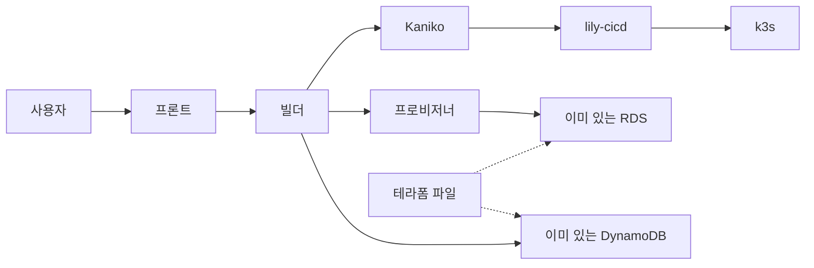
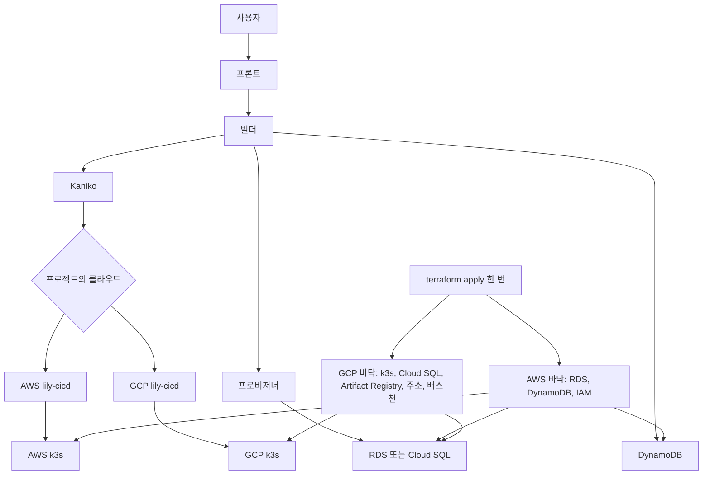
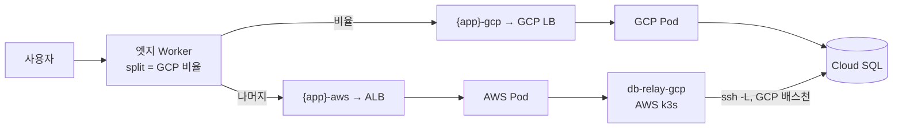

# 결정 기록

## ADR-001. 클라우드 런타임: EC2 위 k3s

- 날짜: 2026-09-30 커밋 (기록: 2026-10-02) · 참여:
- 배경: 플랫폼 모듈과 사용자 앱을 한 클러스터에서 돌린다.
- 선택지: 매니지드 서비스와 비교한 문장은 공개 문서에 없다.
- 결정: EC2 위 k3s. server 1대, worker 2대, t3.medium. AWS 권한은 lily-server만 갖고, 사용자 앱과 Kaniko는 worker에서 돈다.
- 이유: server 역할은 테넌트 DB 비밀번호를 읽을 수 있다. 사용자 코드와 사용자 Dockerfile 실행을 그 노드에 두지 않는다. worker Pod는 IMDS에 닿지 못한다.
- 대가: kubeconfig는 root 전용이라 server에서는 sudo가 필요하다. ServiceAccount를 새로 만들면 ECR Secret 작업을 다시 돌려야 한다. AWS가 필요한 Pod는 server에 고정해야 한다.
- 근거: `lily-db-provisioner/docs/permissions.md`, `lily-db-provisioner/deploy/k3s/cluster/README.md`

## ADR-002. 빌드: 클러스터 안 Kaniko, 빌더 서버는 소스를 받지 않음

- 날짜: 2026-09-30 파일 생성, 마지막 커밋 2026-10-01 (기록: 2026-10-02) · 참여:
- 배경: GitHub 주소만 받아 이미지를 만들고 레지스트리에 올려야 한다.
- 선택지: 공개 문서가 적은 구조는 Kaniko가 GitHub에서 clone하는 것이다. 빌더 프로세스가 소스를 받아 빌드하는 안은 채택 문장으로 남아 있지 않다.
- 결정: k3s Job으로 Kaniko를 띄운다. clone, 빌드, push는 그 Job이 한다. 이 서버는 소스를 받지 않는다.
- 이유: 빌드인 사용자 Dockerfile의 RUN은 AWS 권한이 없는 worker에서 돈다. push 인증은 노드 IAM이 아니라 `ecr-pull` Secret이다. private 레포 토큰은 그 빌드 Secret으로만 넘기고 끝나면 지운다.
- 대가: 빌더만 떠 있고 클러스터 Job을 띄우지 못하면 이미지를 만들지 못한다. 빌드가 끝나는 동안 토큰이 클러스터 Secret에 있다.
- 근거: `lily-builder/src/main/java/com/lily/builder/KanikoBuilder.java`, `lily-builder/README.md`, `lily-db-provisioner/docs/permissions.md`

## ADR-003. 전환: 블루-그린 기본, 100% 전에 30초 판정

- 날짜: 2026-10-01 커밋 (기록: 2026-10-02) · 참여:
- 배경: Ready는 프로세스가 떴다는 뜻이라, 5xx를 내는 버전도 그대로 100%가 될 수 있다.
- 선택지: A. Ready 직후 Service selector를 바꾼다. B. 전환 전에 새 버전과 이전 버전을 비교한다. Rolling Update는 전환 중 두 버전이 한 Service endpoint에 들어갈 수 있어 기본 전략으로 쓰지 않는다 (`lily-cicd/README.md`).
- 결정: 기본은 블루-그린이다. 이전 슬롯이 떠 있으면 30초 동안 cicd가 클러스터 안에서 같은 요청을 양쪽 Service에 보낸 뒤에만 selector를 새 색으로 바꾼다. 사용자 트래픽은 판정이 끝날 때까지 이전 색에 둔다. 실패하면 새 Deployment를 지우고, 이번 스키마 변경을 되돌리며, 응답은 `422 ROLLED_BACK`이다.
- 이유: 사용자 트래픽이 적으면 입구 지표만으로 표본이 모자란다. 같은 요청을 양쪽에 보내면 비교 기준이 같다.
- 대가: 전환이 30초 늦어진다. 첫 배포는 비교할 이전 슬롯이 없어 판정을 건너뛴다. 2026-10-01 실측에서는 판정 중 공개 주소 요청의 일부가 새 버전에 닿았다 (10초 구간별 1/27, 3/25, 2/16). `lily-cicd/README.md`는 사용자 트래픽 10%를 canary Ingress로 보낸다고 적혀 있고, 현재 `CanaryAnalysis`와 `docs/canary-analysis.md`는 사용자 트래픽을 옮기지 않는다고 적는다. 코드와 그 문서가 맞다.
- 근거: `lily-cicd/src/main/java/com/lily/cicd/deploy/CanaryAnalysis.java`, `lily-cicd/docs/canary-analysis.md`, `lily-cicd/src/main/resources/application.yml` (`duration-seconds: 30`)

## ADR-004. 온프레미스 노출: 루프백 프록시와 Cloudflare Tunnel

- 날짜: 2026-10-01 설계 문서 생성, 마지막 커밋 2026-10-02 (기록: 2026-10-02) · 참여:
- 배경: 사용자 PC에서 `https://{app}.{zone}` 을 만들어야 한다.
- 선택지: A. 사용자 네트워크의 인바운드 포트를 연다. B. 에이전트 머신에서 TLS를 끝낸다. C. 터널 origin을 슬롯 포트에 둔다. 채택은 그 셋을 하지 않는 쪽이다. 공인 IP와 자체 방화벽 제품명을 비교한 문장은 없다.
- 결정: 루프백 프록시 하나로 입구를 고정하고, Cloudflare Tunnel ingress의 origin은 `http://127.0.0.1:{proxyPort}` 다. 에이전트는 인바운드 포트를 열지 않고 컨트롤 플레인으로 WebSocket을 연다. 인증서는 Cloudflare 가장자리에 둔다.
- 이유: 슬롯이 바뀔 때마다 터널을 다시 열지 않아도 된다. 인증서 개인키를 사용자 PC에 두지 않는다. 잡을 받으려고 사용자 네트워크의 포트를 열지 않는다.
- 대가: 공개 주소의 TLS는 Cloudflare에서 끝난다. 터널 오리진은 HTTP라 가장자리가 요청 평문을 본다. 주소가 Cloudflare와 터널에 의존한다. PC가 꺼지면, CNAME이 터널을 가리키는 동안 공개 주소도 죽는다. 버스팅 대기 Pod가 있는 앱은 ADR-009의 엣지 Worker와 CNAME 자동 전환이 이어받는다.
- 근거: `lily-on-premise/docs/온프레미스-설계.md`, `lily-on-premise/src/main/java/com/lily/onpremise/expose/CloudflareHostnameProvisioner.java`, `lily-on-premise/src/main/java/com/lily/onpremise/session/WebSocketControlSession.java`

## ADR-005. 버스팅 단위: 요청

- 날짜: 2026-09-30 파일 생성, 마지막 커밋 2026-10-02 (기록: 2026-10-02) · 참여:
- 배경: 로컬이 감당하지 못하는 요청을 클라우드 Ingress로 넘긴다. 공개 호스트는 유지한다.
- 선택지: A. 연결 단위로 나눈다. B. 요청마다 로컬 포트와 클라우드 중 하나를 고른다.
- 결정: B. 로컬에서 처리 중인 요청이 한도이고 넘김이 켜져 있으면 그 요청을 클라우드로 보낸다.
- 이유: cloudflared가 keep-alive로 연결 몇 개에 요청을 모은다. 연결 단위로 나누면 한 번 클라우드로 간 연결이 부하가 끝나도 클라우드에 남고, 어느 쪽으로 갈지 정할 수 없다.
- 대가: WebSocket(101) 이후는 그 연결이 끝날 때까지 한쪽에 남는다. 세션, 로컬 파일, 인메모리 캐시는 양쪽이 공유하지 않는다.
- 근거: `lily-on-premise/src/main/java/com/lily/onpremise/expose/UpstreamProxy.java`, `lily-on-premise/docs/온프레미스-설계.md`

## ADR-006. 스키마 롤백: 클라우드는 전환 전에 되돌리고, 온프레미스는 되돌리지 않음

- 날짜: 2026-10-01 커밋 (기록: 2026-10-02) · 참여:
- 배경: 배포는 앱 이미지와 스키마를 같이 앞으로 옮긴다. 이전 슬롯은 새 스키마 위에서 잠시 돈다.
- 선택지: 클라우드 문서는 트래픽을 옮기기 전 실패에 U 스크립트로 되돌리는 쪽을 적는다. 온프레미스 문서는 적용된 스키마를 남기는 쪽을 적는다. 두 모듈이 같은 규칙을 쓰게 맞춘 문장은 없다.
- 결정: 클라우드는 슬롯 적용이나 Ready 전에 실패하면 이번에 적용한 버전을 U로 되돌린다. 트래픽을 옮긴 뒤의 실패는 되돌리지 않는다. 온프레미스는 Flyway `migrate`만 호출한다. 그 다음 단계가 실패해도 적용된 스키마는 남고, 롤백은 이전 이미지와 프록시 upstream만 되돌린다.
- 이유: 클라우드 배포 한 건은 이미지와 스키마 버전의 쌍이고, 롤백은 직전 쌍으로 옮긴다. 사용자 행은 지우지 않는다. 온프레미스 설계는 스키마를 되돌리지 않는다고 적는다. 그 이상의 이유는 공개 문서에 없다.
- 대가: 온프레미스에서 헬스나 전환이 실패하면 옛 앱이 새 스키마 위에 남을 수 있다. 클라우드는 `lily:irreversible` 이거나 U가 실패하면 스키마가 남은 버전을 실패 이유에 붙이고, 전환 이후에는 되돌리지 않는다.
- 근거: `lily-cicd/docs/schema-migration.md`, `lily-cicd/src/main/java/com/lily/cicd/deploy/DeploymentEngine.java`, `lily-on-premise/src/main/java/com/lily/onpremise/schema/FlywaySchemaApply.java`, `lily-on-premise/docs/온프레미스-설계.md`

## ADR-007. AI 범위: 규칙 먼저, 애매한 것만 더 조심스럽게

- 날짜: 2026-10-01 커밋 (기록: 2026-10-02) · 참여:
- 배경: 빌드 파일이 둘이거나 DB 흔적이 둘이거나, 에러율만으로 롤백하면 짧은 5xx에 정상 배포가 내려갈 수 있다.
- 선택지: A. 그 판단을 모델에 맡긴다. B. 규칙은 유지하고, 규칙이 애매할 때만 묻고, 실패하면 규칙을 유지한다. `lily-jev/README.md`의 "넣지 않은 곳"이 B의 경계다.
- 결정: B. 알려진 배포 실패는 `FailureDiagnoser` 규칙으로 정하고, 모르는 실패만 `AiAdvisor`에 묻는다. 키가 없거나 호출이 실패하거나 늦으면 빈 값이고 호출한 쪽이 규칙으로 정한다. 배포를 막지 않는다. jev는 요청마다 나누는 경로, 슬롯 비율, DB 엔진 생성, 화면 전달에는 넣지 않는다.
- 이유: 그 경로에서 호출 한 번이 로컬 처리보다 느리고, 슬롯 비율을 틀리면 트래픽이 끊긴다. DB 엔진은 배포 요청에 적힌 값을 그대로 만든다.
- 대가: 애매하면 롤백이나 기존 규칙 쪽으로 기운다. 모델이 막아 주는 경우는 확신도가 높을 때로 좁다. 사용자 값과 DB 비밀번호는 보내지 않는다. `lily-jev/README.md`가 적은 builder·observer 호출 지점은, 이 작업 사본의 커밋된 `lily-builder`와 `lily-observer`에서 `com.lily.jev` 참조로 확인되지 않는다.
- 근거: `lily-jev/README.md`, `lily-builder/src/main/java/com/lily/builder/AiAdvisor.java`, `lily-builder/src/main/java/com/lily/builder/FailureDiagnoser.java`

## ADR-008. 롤백과 코드 수정은 별개

- 날짜: 2026-10-01 커밋 (기록: 2026-10-02) · 참여:
- 배경: 나쁜 배포를 걷는 일과, 레포 소스를 고치는 일은 다르다.
- 선택지: 커밋된 코드는 트래픽을 되돌리는 API와, 원인만 적는 진단을 나눠 둔다. 롤백 응답으로 GitHub PR을 만든다는 호출은 커밋된 코드에 없다.
- 결정: `POST /api/apps/{app}/rollback`은 클라우드에서는 lily-cicd의 직전 릴리스로, 내 PC에서는 에이전트에 `type=rollback`을 보낸다. 진단이 코드 수정이 필요하다고 보면 `fixes`는 비우고 `cause`만 적는다. 플랫폼이 자동으로 바꿀 수 있는 것은 환경변수, 포트, DB, 헬스 경로다.
- 이유: 롤백은 직전 슬롯으로 트래픽을 돌린다. 클라우드에서 스키마 버전이 있으면 U가 있을 때만 스키마도 직전 쌍으로 옮긴다. 소스 패치는 그 호출에 없다.
- 대가: 소스 버그는 사람이 레포를 고칠 때까지 남는다. 롤백만으로는 같은 커밋을 다시 배포하지 못하게 막지 않는다.
- 근거: `lily-builder/src/main/java/com/lily/builder/BuildController.java`, `lily-builder/src/main/java/com/lily/builder/CicdClient.java`, `lily-builder/src/main/java/com/lily/builder/AiAdvisor.java`, `lily-cicd/docs/schema-migration.md`

## ADR-009. 내 PC 장애: 엣지 Worker가 요청마다 클라우드로 다시 보내고, CNAME 전환은 예비로 둠

- 날짜: 2026-10-02 커밋 (기록: 2026-10-02) · 참여: 이현수
- 배경: 거점이 내 PC인 앱의 공개 주소 `{app}.lilycloud.kr`은 PC 터널을 가리킨다. PC가 꺼지면 클라우드 대기 Pod가 떠 있어도 응답하지 못한다.
- 선택지: A. Cloudflare Load Balancing (유료 애드온, 월 $5~). B. 에이전트 연결이 끊긴 채 유예 시간이 지나면 builder가 CNAME을 ALB로 바꾼다. C. 공개 주소 앞 Cloudflare Worker가 PC로 보낸 요청이 실패하면 같은 요청을 클라우드로 다시 보낸다. D. 터널 커넥터 이중화. 주/예비가 아니라 상시 분산이 되고 에이전트마다 클러스터 커넥터가 필요하다.
- 결정: C를 앞에 두고 B를 예비로 둔다. Worker `lily-edge`는 요청을 원래 오리진(CNAME 내용물)으로 보낸다. 530(터널 커넥터 없음)이나 연결 실패면 모든 메서드를, Cloudflare가 만든 502/503/504/52x 오류 페이지면 GET/HEAD/OPTIONS만 `{app}-cloud.lilycloud.kr`(ALB → 대기 Pod)로 다시 보낸다. GET/HEAD/OPTIONS는 PC 응답 헤더를 2.5초까지만 기다린다(SSE·WebSocket 제외). 한 번 실패하면 10초 동안 PC를 건너뛰고, 그 표시는 Cache API에 둬 같은 데이터센터의 isolate가 함께 본다. 라우트와 `-cloud` 주소는 대기 배포가 끝난 앱에만 만들고, cicd는 그 주소를 Ingress 별칭(`aliases`)으로 받는다. B는 `AgentFailover`가 60초(`FAILOVER_GRACE_SECONDS`) 뒤 클라우드 레플리카를 2로 올리고 Ready를 확인한 다음 CNAME을 ALB로 바꾼다.
- 이유: B만으로는 유예 시간과 DNS 반영 동안 끊긴다 (실측 63초 뒤 전환, 74초부터 200). C는 요청 단위라 유예가 없고 무료 한도(일 10만 요청) 안이다. 터널이 붙은 채 PC가 멈추면 엣지는 6~14초 뒤에야 502를 내서, 헤더 시간 제한과 공유 표시를 넣었다 (전환 순간 최장 6.3·13.8초 → 3.8·4.0초).
- 대가: PC가 받았을 수 있는 POST 등은 두 번 처리되지 않게 다시 보내지 않아서, 터널이 붙은 채 PC가 멈춘 직후의 첫 요청은 오류로 끝난다. 1MB를 넘거나 길이를 모르는 본문은 다시 보내지 않는다. 대기 Pod가 없는 앱, DB가 PC에 있는 앱은 이어받지 못한다. 비율 분배는 여전히 PC 프록시가 해서 정상일 때 모든 요청이 PC를 거친다. 플랫폼 Cloudflare 토큰에 Workers Scripts·Routes Edit 권한이 필요하다.
- 근거: `lily-builder/src/main/resources/edge/worker.js`, `lily-builder/src/main/java/com/lily/builder/EdgeWorker.java`, `lily-builder/src/main/java/com/lily/builder/AgentFailover.java`, `lily-builder/docs/장애-자동-전환.md`, `lily-cicd/src/main/java/com/lily/cicd/module/NginxIngressRouter.java`

## ADR-010. 내 PC 앱의 DB 위치: 내 PC, 기존 DB, 클라우드 중 선택

- 날짜: 2026-10-02 커밋 (기록: 2026-10-02) · 참여: 이현수
- 배경: 내 PC 앱의 DB가 RDS뿐이면 PC 앱은 항상 터널로 RDS에 붙어야 하고, 사용자가 이미 쓰는 DB나 PC 안의 DB를 쓸 수 없다. 버스팅 대기 Pod는 PC 앱과 같은 DB를 봐야 한다.
- 선택지: A. 항상 RDS. PC 앱은 `ssh -L`로 붙는다. B. 프로젝트마다 DB 위치를 고른다.
- 결정: B. `local`은 에이전트가 엔진마다 컨테이너(`lily-postgres`·`lily-mysql`)를 host 네트워크로 띄워 127.0.0.1·172.17.0.1에만 열고, 앱마다 database와 계정을 만든다. `external`은 사용자 DSN을 쓰고, `localhost`는 앱에 `host.docker.internal`로 넘기며 배포 전에 TCP 연결을 확인한다. `cloud`는 기존 RDS `ssh -L`이다. 대기 Pod가 PC DB를 써야 하면 에이전트가 `ssh -R`로 lily-server 사설 IP의 포트(20000-20999 중 에이전트마다 하나, ConfigMap `lily-agent-db-ports`)에 DB를 열고, builder가 그 주소로 만든 `databaseEnv`를 cicd에 넘긴다. cicd는 `databaseEnv`가 있으면 provisioner를 부르지 않는다.
- 이유: `lily-tunnel`은 셸 없이 포워딩만 된다. 에이전트 인증서는 플랫폼 SSH CA가 서명하고, `AuthorizedPrincipalsCommand`가 key ID(`agent-{key}-p{port}`)의 포트에만 `permitlisten`을 준다. 에이전트가 다른 에이전트의 포트를 열면 그 대기 Pod의 DB 접속을 가로채게 되므로 포트는 에이전트마다 하나로 고정한다.
- 대가: DB가 PC에 있으면 PC가 꺼질 때 DB도 꺼져 대기 Pod와 장애 전환이 이어받지 못한다. 역방향 포트는 lily-server 한 대에 묶인다. 거점 전환 때 DB 이전은 PostgreSQL이고 DB가 출발 거점 쪽(내 PC 또는 RDS)일 때만 된다. 터널이 끊기면 에이전트가 5초마다 확인해 다시 연다.
- 근거: `lily-on-premise/src/main/java/com/lily/onpremise/database/DatabaseModes.java`, `lily-on-premise/src/main/java/com/lily/onpremise/database/ReverseTunnel.java`, `lily-on-premise/src/main/java/com/lily/onpremise/burst/DatabaseTunnel.java`, `lily-builder/src/main/java/com/lily/builder/AgentDatabasePorts.java`, `lily-db-provisioner/deploy/k3s/cluster/lily-tunnel-reverse.sh`, `lily-cicd/src/main/java/com/lily/cicd/deploy/DeployRequest.java`

## ADR-011. 스키마 변경: pgroll 로 두 버전이 같은 DB 를 함께 쓴다

- 날짜: 2026-10-03 커밋 (기록: 2026-10-03) · 참여: 이현수
- 배경: 블루그린 판정과 카나리 가중치 동안 이전 버전과 새 버전이 같은 DB 를 쓴다. Flyway 방식은 이전 버전이 새 스키마 위에서 돌기 때문에 이름·타입 변경과 기본값 없는 `NOT NULL` 을 막았고, 전환 뒤에는 스키마를 되돌리지 않았다 (ADR-006).
- 선택지: A. 지금처럼 호환 규칙(lint)으로 막고 expand/contract 를 배포 여러 번에 나눈다. B. pgroll 로 한 DB 에 스키마 버전 두 개(버전마다 뷰 스키마)를 두고, 두 버전의 쓰기를 up/down 트리거가 맞춘다.
- 결정: B. 앱 레포 `db/pgroll/{번호}_{설명}.yaml` 이 있으면 lily-builder 가 그 파일을 보내고, lily-cicd 가 이전 active 를 complete 한 뒤 새 마이그레이션을 start 한다. 새 슬롯은 Secret 의 `DB_URL` 에 `currentSchema=public_{이름}` 으로 붙는다. 전환 뒤 600초 롤백 창 동안은 앱과 스키마를 함께 되돌리고(pgroll rollback), 창이 지나거나 다음 배포가 오면 complete 한다. `pgroll init` 은 이벤트 트리거라 관리자 권한이 필요해서 lily-db-provisioner 의 `POST /api/databases/{id}/pgroll` 이 하고, 나머지는 프로젝트 계정으로 돈다.
- 이유: 새 버전이 쓴 값은 down 트리거로 옛 컬럼에 이미 들어가 있어서, 전환 뒤 롤백해도 그사이 행을 잃지 않는다. 앱 코드는 접속 URL 외에 바뀌지 않는다. pgroll 트리거는 `search_path` 가 최신 버전 스키마와 정확히 같을 때만 새 버전의 쓰기로 보므로 `currentSchema` 에는 버전 스키마 하나만 넣는다.
- 대가: 이전 슬롯이 떠 있으면 배포마다 새 마이그레이션은 하나다. 롤백 창이 닫힌 뒤에는 스키마를 되돌릴 수 없고, 다음 배포가 오면 창이 일찍 닫힌다. 롤백하면 새 버전에서 추가한 컬럼 값은 없어진다.
- 근거: `lily-cicd/docs/schema-migration.md` 7 절, `lily-cicd/src/main/java/com/lily/cicd/schema/PgrollMigrator.java`, `lily-cicd/src/main/java/com/lily/cicd/deploy/PgrollSchema.java`, `lily-db-provisioner/src/main/java/com/lily/dbprovisioner/engine/PostgresProvisioner.java`, `lily-builder/src/main/java/com/lily/builder/GitHubSource.java`. 공용 RDS 실측: 블루그린 요청 3,105건, 카나리(20→100%) 1,752건 실패 0, 카나리 구간 두 버전 동시 쓰기(v1 1,018행, v2 380행), 전환 후 롤백 뒤 행 누락 0

## ADR-012. 클러스터 배포 전략: 카나리

- 날짜: 2026-10-03 (기록: 2026-10-03) · 참여: 이현수, 팀 합의
- 배경: ADR-003 의 블루그린은 판정 30초 동안 사용자 트래픽을 이전 색에 두고 한 번에 100% 로 넘긴다. 실제 사용자 요청으로 새 버전을 조금씩 확인하는 단계가 없다.
- 선택지: A. 블루그린 유지. B. `CanaryDeploymentStrategy` 로 바꾼다.
- 결정: B. `deploy/k3s/lily-cicd.yaml` 의 `LILY_DEPLOY_STRATEGY=canary`. 판정(30초)을 통과하면 `{app}-canary-ingress` 의 `canary-weight` 를 20%씩 30초마다 올려 100% 에서 Service `track` 을 옮긴다.
- 이유: 가중치를 올리는 동안 두 버전이 같은 DB 에 쓰는데, ADR-011 의 pgroll 로 스키마가 바뀌는 배포에서도 이것이 안전해졌다.
- 대가: 전환이 판정 30초에 가중치 2분 30초가 더해진다. 슬롯 이름이 `blue`/`green` 에서 `stable`/`canary` 로 바뀐다. 블루그린으로 배포된 앱은 다음 배포에서 `stable` 슬롯으로 새로 시작한다.
- 근거: `lily-cicd/deploy/k3s/lily-cicd.yaml`, `lily-cicd/src/main/java/com/lily/cicd/deploy/CanaryDeploymentStrategy.java`, `lily-cicd/README.md`

## ADR-013. 배포 모드: 하이브리드와 온프레미스 전용

- 날짜: 2026-10-03 · 참여: 이현수
- 문제상황: 내 PC 거점은 넘친 요청과 장애 요청을 k3s 로 보낸다. 그때 요청 본문은 클라우드에서 처리되고, 기본 DB 는 RDS 라 저장된 데이터도 클라우드에 있다. 데이터를 PC 안에만 두고 싶은 선택과, 거점을 오가며 버스팅을 쓰는 선택이 같은 배포 흐름에 섞여 있다.
- 분석: 거점 전환이 DNS 만으로 되는 이유는 양쪽이 같은 RDS 를 보기 때문이다. DB 가 PC 에 있으면 PC 가 꺼질 때 DB 도 꺼져서, 대기 Pod 와 엣지가 이어받을 데이터가 없다. 그래서 버스팅과 장애 전환은 그 배치에서 물리적으로 불가능하다. 하이브리드와 온프레미스 전용 사이를 나중에 바꾸는 것은 데이터 이사라 이번 범위 밖이다.
- 해결: 프로젝트를 만들 때 `deploymentMode` 를 `HYBRID`(기본) 또는 `ONPREM_ONLY` 로 고정한다. 하이브리드의 클라우드/내 PC 는 거점이다. DB 가 RDS 이면 거점 전환은 CNAME 만 바꾼다. 내 PC 거점은 `local`·`external` 도 고를 수 있고, 대기 Pod 는 `ssh -R` 로 그 DB 에 붙는다. 온프레미스 전용은 DB 를 PC 의 `lily-postgres` 또는 `lily-mysql` 로 고정하고, 역방향 터널·버스팅·거점 전환·RDS 프로비저닝을 DNS 와 스케일보다 앞에서 거절한다. 모드 변경 요청은 `409 MODE_LOCKED` 다. 기존 프로젝트는 하이브리드로 남는다. `databaseMode=local` 인 기존 앱은 역방향 터널과 버스팅이 있는 하이브리드이고, 온프레미스 전용이 아니다.
- 결과: RDS 를 쓰는 앱은 거점을 DNS 로 옮긴다. 온프레미스 전용은 요청과 데이터가 PC 안에 있고, PC 가 꺼지면 서비스가 멈춘다. TLS 는 Cloudflare 에서 끝난다. 로컬 DB 비밀번호는 PC 밖으로 나가지 않고, 백업은 볼륨 `lily-postgres-data`·`lily-mysql-data` 에 대한 사용자 책임이다. 컨테이너는 기존과 같이 host 네트워크의 `127.0.0.1`·`172.17.0.1` 에만 듣는다.
- 근거: `lily-builder/src/main/java/com/lily/builder/AgentDeployService.java`, `lily-on-premise/src/main/java/com/lily/onpremise/job/DeployJob.java`, `lily-frontend/db/migrations/013-deployment-mode.sql`

## ADR-014. 플랫폼 바닥은 테라폼, 사용자 앱 변경은 cicd

- 날짜: 2026-10-03 · 참여: 이현수
- 문제: 하이브리드의 클라우드가 AWS 와 GCP 로 나뉜다. 사용자 앱이 뜨는 k3s, lily-cicd, 데이터베이스, 레지스트리, 로드밸런서, 배스천은 클라우드마다 있어야 한다. 프론트, 빌더, Cloudflare, 배포 이력 DynamoDB 는 AWS 한곳에 둔다. 이 바닥을 콘솔에서만 만들면 두 클라우드의 구성이 어긋나고, 사용자 배포마다 테라폼을 돌리면 카나리와 스키마 롤백을 state 가 따라가지 못한다. `infra/` 의 AWS 파일은 저장소에 있으나 배포 경로가 호출하지 않고, 백업 1일·삭제 보호 없음·빈 state 로 apply 하면 운영 RDS 를 이어받지 않고 새 인스턴스를 만든다.
- 분석: 전은 바닥 파일이 실행되지 않고, 배포가 이미 있는 RDS 와 DynamoDB 에 붙는다. 후는 apply 한 번이 바닥을 만들고, 그 다음 사용자 배포는 지금과 같이 빌더와 cicd 가 한다.

- 해결: 사용자 앱의 이미지, 카나리, 스키마는 테라폼 밖에 둔다. GCP 바닥은 `lily-db-provisioner/infra/gcp` 에 둔다. 서울 리전, k3s server 1대와 worker 2대, 공개 주소 하나, Cloud SQL Postgres 16, Artifact Registry, Cloud SQL 로만 포워딩하는 배스천이다. apply 결과는 빌더의 `GCP_*` 환경변수 초안 `.env.gcp` 다. `GCP_CICD_URL` 과 `GCP_PROVISIONER_URL` 은 그 클러스터에 lily-cicd 와 프로비저너를 올린 뒤에 채운다. 기존 AWS 루트는 운영 계정에 빈 state 로 apply 하지 않는다. 이미 있는 RDS 를 코드에 맡기려면 import 가 먼저다.
- 성과: 두 클라우드에 복제되는 바닥은 코드로 나란히 있다. GCP 프로젝트에 plan, apply 하기 전에는 자원이 생기지 않는다. 컨트롤 플레인은 AWS 에 남고, 사용자 배포 경로는 바뀌지 않는다.
- 근거: `lily-db-provisioner/infra/gcp`, `lily-db-provisioner/infra/rds.tf`, `lily-builder/src/main/resources/application.yml`

## ADR-015. 멀티클라우드: 한 앱을 GCP 와 AWS 에 같이 띄우고, DB 는 Cloud SQL 하나

- 날짜: 2026-10-04 · 참여: 이현수
- 문제: ADR-014 로 프로젝트마다 AWS 나 GCP 하나를 고를 수 있게 됐다. 한 앱을 두 클라우드에 같이 띄워 요청을 나누고, 한쪽이 죽어도 다른 쪽이 받게 하려면 배포·DB·트래픽을 어디서 묶을지 정해야 한다. 클라우드 사이에는 사설 경로가 없다. AWS Pod 는 Cloud SQL 사설 IP 에, GCP Pod 는 RDS 에 닿지 못한다.
- 분석:
  - DB: 클라우드마다 DB 를 두고 양방향 복제를 하면 쓰기 충돌을 풀어야 하고, 논리 복제는 DDL 을 옮기지 않아 pgroll 버전 스키마와 맞지 않는다. 프라이머리 하나를 두고 다른 클라우드가 그 DB 에 붙으면 충돌이 없고, 두 앱 버전이 같은 DB 를 쓰는 지금의 pgroll·카나리 구조를 그대로 쓴다. 대가는 DB 가 있는 클라우드가 통째로 죽으면 다른 쪽도 DB 를 못 쓴다는 것이다.
  - 경로: 사이트 간 VPN 은 시간당 비용과 양쪽 콘솔 작업이 든다. DB 공인 IP 허용은 노출이 크다. 에이전트 DB 터널과 같은 SSH CA·배스천을 쓰는 클러스터 안 릴레이는 추가 비용이 없고, 배스천이 이미 Cloud SQL 로의 `-L` 만 허용한다.
  - 트래픽: Cloudflare Load Balancing 은 유료 애드온이다. 이미 모든 앱 주소 앞에 있는 엣지 Worker 와 앱별 Durable Object 설정에 비율을 두면 화면에서 바로 바꿀 수 있다.
  - DB 위치를 GCP 로 고르면 릴레이가 AWS 클러스터에 있어 팀이 직접 배포·운영할 수 있다. RDS 로 두려면 GCP 클러스터에 릴레이와 cicd 변경을 올려야 해서 미뤘다.

- 해결: 프로젝트 클라우드에 `MULTI` 를 둔다 (만든 뒤 잠금, 클라우드 배포만, PostgreSQL 만).
  - 배포: 한 번 빌드해 Artifact Registry 와 ECR 에 올린다. GCP 에 먼저 일반 배포(DB 생성, 마이그레이션·pgroll, 카나리)를 하고, AWS 에는 마이그레이션 없이 GCP 접속 정보의 호스트만 릴레이로 바꾼 `databaseEnv` 와 `followPgroll` 로 배포한다. AWS 가 실패하면 GCP 를 되돌려 두 쪽이 같은 버전을 유지한다.
  - 스키마: pgroll 은 GCP lily-cicd 만 돌린다. AWS 쪽은 최신 버전 스키마로 접속만 하고 스키마 버전을 기록하지 않는다. 롤백은 AWS 앱부터, 그다음 GCP 스키마.
  - 트래픽: `{app}-gcp`·`{app}-aws` 별칭과 Worker 라우트. Worker 가 요청마다 비율로 고르고, 받지 못한 쪽(연결 실패·530, GET/HEAD/OPTIONS 는 엣지 오류와 오리진 502/503/504 까지)은 반대쪽으로 다시 보내고 10초 건너뛴다. POST 등은 두 번 처리될 수 있어 다시 보내지 않는다. 고정 세션은 두지 않는다.
  - 릴레이: `lily-builds/db-relay-gcp` (replicas 2). 키는 builder 가 한 번 만들고, key ID `relay-gcp` 의 24시간 인증서를 6시간마다 다시 서명한다. `default`·`lily-system` 에서만 붙는다.
  - 이름: 별칭과 겹치는 앱(`X-aws`·`X-gcp`)이 있으면 멀티클라우드 배포를, 멀티클라우드 앱이 있으면 그 별칭 이름의 새 배포를 빌드 전에 거절한다.
- 결과: 운영 E2E 에서 비율 분배, 같은 DB 읽기·쓰기, pgroll 변경 중 쓰기 손실 0, 롤백, 한쪽 앱 Pod 0·한쪽 클라우드 접속 불가 때 GET 실패 0 을 확인했다. 남은 한계: DB 클라우드(GCP) 전체 장애, 앱 Pod 수가 두 배라 Cloud SQL 커넥션 한도, AWS 쪽 쿼리의 릴레이 지연, 세션을 메모리에 두는 앱, 내 PC 앱과 MySQL 은 대상이 아니다.
- 근거: `lily-builder/src/main/java/com/lily/builder/BuildService.java`(`executeMulti`), `CloudRouting.java`, `DatabaseRelay.java`, `src/main/resources/edge/worker.js`(`multi`), `lily-cicd/src/main/java/com/lily/cicd/deploy/DeploymentEngine.java`(`followPgroll`), `lily-db-provisioner/deploy/k3s/cluster/db-relay-gcp.yaml`, `lily-frontend/db/migrations/019-multi-cloud.sql`
